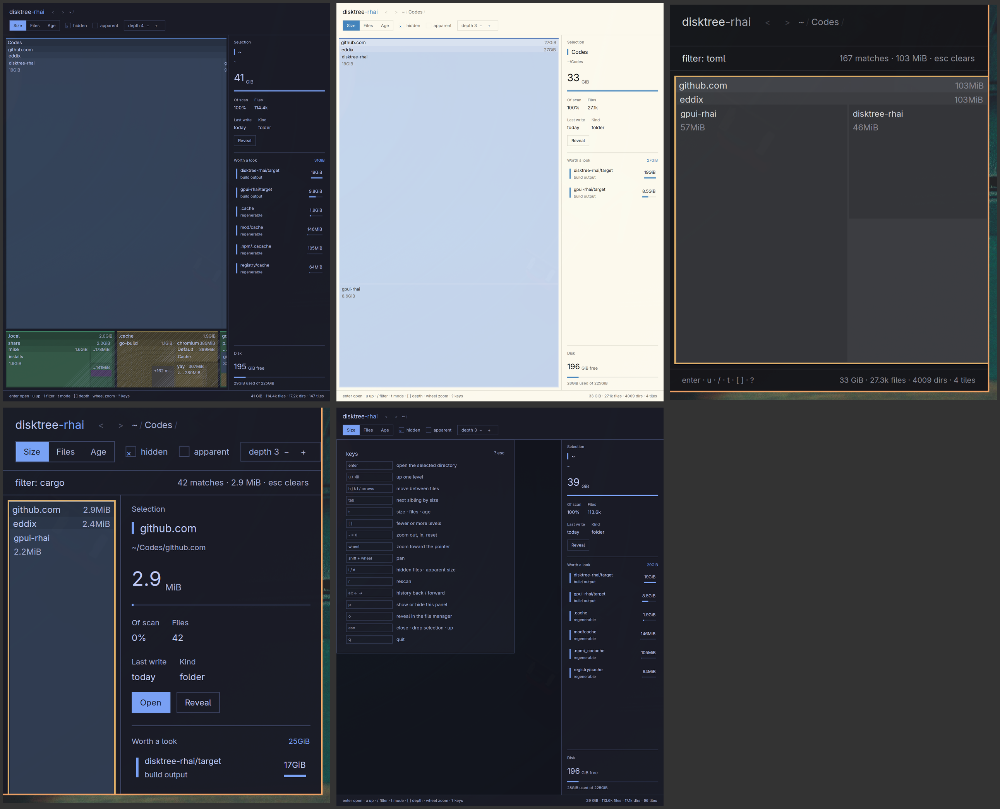

# disktree-rhai

Disk space as a squarified treemap — a faithful port of
[tobi/disktree](https://github.com/tobi/disktree) whose entire UI is a
[Rhai](https://rhai.rs) skin running on
[gpui-rhai](https://github.com/eddix/gpui-rhai).



Default skin (dark), Flexoki Light (`--theme light`), the bundled
`minimal` skin (slice-and-dice tiling, grayscale), the `cargo` typeahead
filter, and the `?` help overlay.

```sh
cargo run --release -- /some/path
```

## The idea

- The **Rust side** owns the engine: du-faithful scanning (allocated
  blocks, hard links counted once, single filesystem, symlinks not
  followed), window plumbing, and the skin loader. 45 unit tests,
  including `du` parity.
- **Everything you see is the default skin**: plain Rhai source under
  `ui/`, embedded into the binary — the tiling algorithm included.
  Export it, reshape it, load it back:

```sh
disktree-rhai --export-skin my-skin   # writes the live UI source to
                                       # $XDG_CONFIG_HOME/disktree-rhai/skins/my-skin/
$EDITOR ~/.config/disktree-rhai/skins/my-skin/main.rhai
disktree-rhai --skin my-skin           # run your skin
disktree-rhai --skin-dev my-skin       # hot reload while editing
disktree-rhai --skin ./skins/minimal   # the bundled second skin
```

- `--dev` runs the built-in `ui/` from source with hot reload — the
  dogfood loop the default skin itself is developed in.

A skin directory is `app.toml`, `main.rhai`, `core.rhai`,
`components/widgets.rhai`, `theme.rhai`, and optional extra theme
variants under `themes/`. Skins own the tiling (`core.rhai`), the
palette, the panels, and the keymap — everything above the scan
capabilities.

## Keys

`enter` open · `u`/⌫ up · `h j k l`/arrows move · `tab` next sibling ·
`/` filter · `t` size·files·age · `[ ]` depth · `- = 0` zoom · wheel
zoom / shift-wheel pan · `alt`←→ history · `i` hidden · `d` apparent ·
`r` rescan · `p` sidebar · `o` reveal · `?` help · `q` quit · `esc`
close/clear/ascend.

## CLI

```
disktree-rhai [PATH] [-a] [-H] [-d 1-6] [--metric files|bytes]
              [--skin NAME|PATH] [--skin-dev NAME|PATH] [--dev]
              [--export-skin NAME] [--theme dark|light|system]
```

`--theme` resolution: explicit flag → Omarchy theme
(`~/.local/state/omarchy/current/theme/colors.toml`, degradable) →
dark. The family ships two variants — Tokyo Night and Flexoki Light —
and `system` follows the window appearance live, mosaic palette
included.

## Acceptance

- Feature matrix against tobi and gpuix: [docs/FEATURES.md](docs/FEATURES.md)
- Blind-exercised interaction checklist: [docs/CHECKLIST.md](docs/CHECKLIST.md)
- Design consensus: [docs/DESIGN.md](docs/DESIGN.md)
- What building this found in gpui-rhai (three upstream PRs):
  [docs/UPSTREAM_GAPS.md](docs/UPSTREAM_GAPS.md)

## Development

```sh
cargo run -- --dev                   # built-in skin from source, hot reload
cargo run --example spike_squarify   # M0 spike: op budget of the layout port
cargo run --example spike_canvas     # M0 spike: retained canvas at scale
cargo run --example du_parity        # engine vs du
cargo run --example rhai_check -- ui/main.rhai
```

Requires Rust 1.95 and [gpui-rhai](https://github.com/eddix/gpui-rhai)
checked out as a sibling directory (`../gpui-rhai`) on branch
`disktree-integration` until upstream PRs
[#96](https://github.com/eddix/gpui-rhai/pull/96),
[#97](https://github.com/eddix/gpui-rhai/pull/97),
[#99](https://github.com/eddix/gpui-rhai/pull/99) and
[#100](https://github.com/eddix/gpui-rhai/pull/100) merge:

```sh
git clone https://github.com/eddix/gpui-rhai ../gpui-rhai
git -C ../gpui-rhai checkout disktree-integration
```

## Status

M0–M5 complete. v1.5 candidates: crumb sibling menus, growth animation,
volumes view, the DaisyDisk-style radial skin the `skins/` directory is
reserved for.
